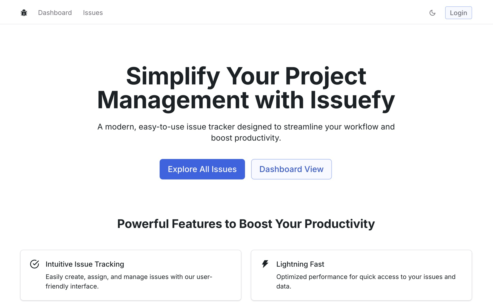

<h1 align="center">Issuefy</h1>

<p align="center">
A sleek and simple issue tracker for your project.
</p>

<p align=center>
  
<p>

<div align= "center">

[](https://twitter.com/yntpdotme) &nbsp; [](https://www.linkedin.com/in/yntpdotme/) &nbsp; [](mailto:akashkadlag14@gmail.com) &nbsp; [](https://conventionalcommits.org)&nbsp; [](https://choosealicense.com/licenses/mit/)

</div>

</div>

<h2 align="center">

 &nbsp;[See it in Action](https://issuefy.vercel.app/) &nbsp;»

</h2>

<br>

<p align="center">
  <a href="#introduction"><strong>Introduction</strong></a> 
	·&nbsp;<a href="#features"><strong>Features</strong></a> 
	·&nbsp;<a href="#tech-stack"><strong>Tech Stack</strong></a>
	·&nbsp;<a href="#local-development"><strong>Development Setup</strong></a> 
	·&nbsp;<a href="#local-development"><strong>Contributing</strong></a> 
</p>

<br>

## <a name="introduction">❄️&nbsp;Introduction</a>

Issuefy is a modern, easy-to-use issue tracker designed to simplify the management of your project’s issues. Whether you're managing bugs, feature requests, or general tasks, Issuefy helps you stay organized and productive. Delve into the codebase to explore more.

<br>

<a href="https://issuefy.vercel.app/">
  <p align=center>
    
  <p>
</a>

<br>

## <a name="features">🔋&nbsp; Features</a>

- &nbsp;&nbsp;▲&nbsp;&nbsp; Next.js 15 with Server Actions

- &nbsp;🚥&nbsp;&nbsp; Full-featured issue tracking and management

- &nbsp;📊&nbsp;&nbsp; Intelligent dashboard with issue metrics

- &nbsp;🔍&nbsp;&nbsp; Advanced filtering and sorting capabilities

- &nbsp;💾&nbsp;&nbsp; Prisma ORM with PostgreSQL integration

- &nbsp;🗃️&nbsp;&nbsp; Organized File and Folder Structure

- &nbsp;🔑&nbsp;&nbsp; Credentials & OAuth Providers (Google & GitHub)

- &nbsp;🔒&nbsp;&nbsp; Secure Password Reset

- &nbsp;🥏&nbsp;&nbsp; TypeScript for Type Safety

- &nbsp;🐳&nbsp;&nbsp; Docker Containerization for Consistent Development

- &nbsp;☾&nbsp;&nbsp; Light and Dark Mode Support

<br>

## <a name="tech-stack">⚙️&nbsp; Tech Stack</a>

- [Next.js](https://nextjs.org) – React Framework

- [Radix UI](https://www.radix-ui.com) – Component library

- [Tailwind CSS](https://tailwindcss.com/) – CSS

- [TypeScript](https://www.typescriptlang.org/) - TypeSafe JavaScript

- [Zod](https://zod.dev/) - Schema Declaration & Validation Library

- [Prisma](https://www.prisma.io) – ORM

- [Postgres](https://neon.tech/) - Database

- [Auth.js](https://authjs.dev/) – Authentication

- [Resend](https://resend.com/) – Email API For Developers

- [Git](https://git-scm.com) – Versioning

- [Vercel](https://vercel.com) – Deployments

<br>

## <a name="local-development"> 🖥️&nbsp;&nbsp; Local Development</a>

0.  **Prerequisites** <br>
    Make sure you have the following installed on your machine:

    - [Git](https://git-scm.com/)
    - [Node.js](https://nodejs.org/en) (v20+)
    - [Docker](https://www.docker.com/)
    - [pnpm](https://pnpm.io/) (Package Manager)

1.  **Clone the repository:**

    ```bash
    git clone https://github.com/yntpdotme/issuefy.git
    ```

2.  **Navigate to the project directory:**

    ```bash
    cd issuefy
    ```

3.  **Install dependencies:**

    ```bash
    pnpm install
    ```

4.  **Add Environment Variables:**

    Create `.env` file in the root folder and copy paste the content of `.env.sample`

    ```bash
    cp .env.sample .env
    ```

    Update credentials in `.env` with your credentials.

5.  **Setup Database**

    Start Postgres with Docker

    ```bash
    docker compose up -d
    ```

    Setup Prisma

    ```bash
    pnpm prisma generate
    pnpm dlx prisma migrate dev
    ```

    Populate the Database:

    ```bash
    pnpm seed
    ```

6.  **Start the App:**

    ```bash
    pnpm dev
    ```

    Visit &nbsp;[http://localhost:3000](http://localhost:3000)&nbsp; to access your app.

7.  **Start Prisma Studio:**

    ```bash
    pnpm prisma studio
    ```

    Visit &nbsp;[http://localhost:5555](http://localhost:5555)&nbsp; to access prisma studio.

<br>

## 🤝&nbsp;&nbsp;Contributing

Contributions are always welcome!

See [CONTRIBUTING.md](./CONTRIBUTING.md) for ways to get started.
</br></br>

## 🪪&nbsp;&nbsp; License

Issuefy is open-source under the [MIT License](./LICENSE).
Feel free to learn, add upon, and share!
